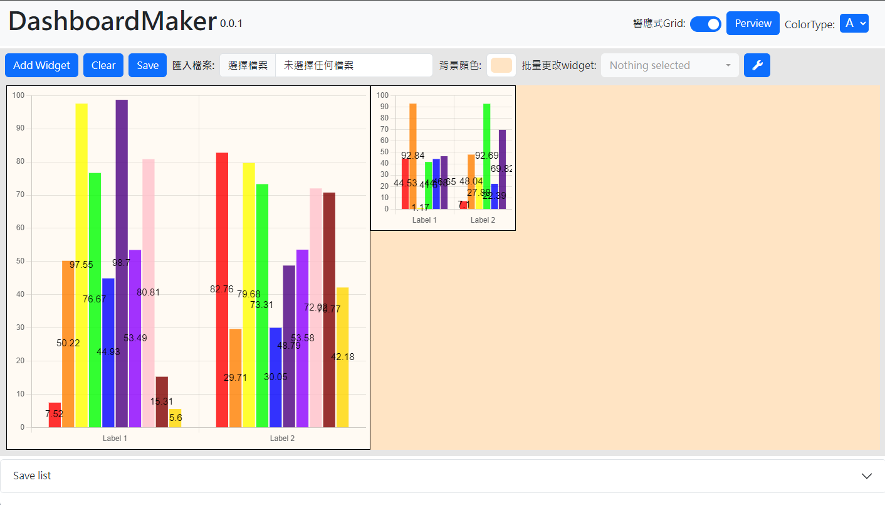

# 說明 v0.0.1

>## ❗ 提醒
>### 版本號變化說明 (v A.B.C)：  
>- **A**：重大更新，無法將舊有 JSON 讀入並重新編輯，更新時需要重新製作版面。  
>- **B**：部分功能更新，重新編輯時會顯示版本警告，並將所有 `widgetID` 重新排列（可能會影響圖表百分比顯示）。  
>- **C**：小更新，不影響功能使用。

- [Maker](#maker)
    - [全域](#全域功能)
    - [Widget](#widget功能-由左至右敘述)

- [Helper](#helper-functions)
    - [載入](#loadtemplategridid-template)
        - [loadTemplate(gridID, template)](#loadtemplategridid-template)
        - [importData(gridID, widgetID, inputData)](#importdatagridid-widgetid-inputdata)
    - [改顏色](#changegridcolorgridid-inputcolor)
        - [changeGridColor(gridID, inputColor)](#changegridcolorgridid-inputcolor)
        - [changeWidgetColor(gridID, widgetID, inputColor)](#changewidgetcolorgridid-widgetid-inputcolor)
    - [客製](#changetxtareagridid-widgetid-inputhtml)
        - [changeTxtArea(gridID, widgetID, inputHTML)](#changetxtareagridid-widgetid-inputhtml)
        - [headerTxt(gridID, widgetID, String)](#headertxtgridid-widgetid-string)
    - [截圖](#gridtojpggridid)
        - [gridToJPG(gridID)](#gridtojpggridid)
        - [widgetToJPG(gridID, widgetID)](#widgettojpggridid-widgetid)

- [資料格式](#資料格式)
    - [大部分](#bar--line--pie--table--doughnut--radar)
    - [Mix](#mix)
    - [Key/Value](#key--value)
    - [Progress](#progress)
    - [Custom](#custom)

### 目前提供 **10** 種圖表類型及 **7** 種顏色選擇。
>### 圖表  
>- **長條圖 Bar**  
>- **折線圖 Line**  
>- **圓環圖 Doughnut**  
>- **圓餅圖 Pie**  
>- **雷達圖 Radar**  
>- **長條/折線混和圖 Mix**  
>- **Table**  
>- **進度條 Progress**  
>- **Key/Value**  
>- **客製 Custom** (含有 `<script>` 標籤的部分無法匯入) 

---

# Maker

>### 套件版本  
>- **`Bootstrap`**: v5.3.3  
>- **`jQuery`**: v3.6.0  
>- **`GridStack`**: v10.2.0  
>- **`Chart.js`**: v3.7.1（包含 `chartjs-plugin-datalabels` v2.2.0）  
>- **`Bootstrap-table`**: v1.22.1  
>- **`Bootstrap-icon`**: v1.10.5  
>- **`Bootstrap-select`**: v1.14.0-beta2  
>- **`html2canvas`**: v0.4.1  
>- **`fontawesome`**: v4.6.1 / v5.14.0



## 全域功能
- **`Add Widget`**：新增一個全新的 Widget（預設大小：2x2 長條圖）。  
- **`Clear`**：清除所有 Widgets。  
- **`Save`**：將當前版面儲存為 `grid-layout.json` 檔案，並顯示於 Save List 中，可點擊上方的 **下載布局** 進行下載。  
- **`匯入檔案`**：匯入現有的 .json 檔案。  
- **`背景顏色`**：更改目前 Grid 的背景顏色。  
- **`批量更改 Widget`**：選擇要更改的 Widget 並調整其樣式。  
- **`響應式 Grid`**：開啟後，若視窗寬度縮小至 768px，所有 Widget 將變為直排列；關閉後，縮小視窗僅會使 Widget 等比縮小。(針對Grid判斷)  
- **`Preview`**：跳轉至預覽頁面，可查看在其他網頁中的效果。  
- **`ColorType`**：更改 Grid 中所有圖表的色系。

## Widget功能 (由左至右敘述) 
- **`lock`**：鎖定當前的 Widget。  
- **`圖表Select`**：變更目前 Widget 的圖表類型。  
- **`設定`**：設定目前 Widget 的內容。  
- **`刷新數據`**：刷新目前 Widget 的隨機數據。  
- **`複製`**：複製目前的 Widget，但不會複製內部文字。

---

## 🔴 注意事項
1. Grid 的響應式特性須於編輯時決定，後續無法調整。  
2. `複製` 功能不會將 Widget 內的文字一同複製。

# Helper Functions
## ⚠️ 注意  
### 執行順序：`loadTemplate` → `importData` → 其他動作

## 🟡 提示
### 可使用 `Chart.getChart(ID)` 獲取圖表的 config 並修改，修改後執行 `Chart.getChart(ID).update()` 來更新圖表（僅限 Chart.js 圖表）。

>`gridID` : *{ String }* 要呈現圖表的元素ID  
>`widgetID` : *{ Number }* 要匯入資料的widget ID
---

### `loadTemplate(gridID, template)`
### 載入模板
- `template` : *{ Object }* JSON模板/布局(來自Maker)
```javascript
$.getJSON('/exsample.json', function (JSON) {
    loadTemplate("gridID", JSON).then(() => {
        //需要執行的程式
    })
}).fail(function (jqXHR, textStatus, errorThrown) {
    console.error('There has been a problem with your JSON operation:', textStatus, errorThrown);
});
```
### `importData(gridID, widgetID, inputData)`

### 引入單個 widget 的 data
>- `inputData` : *{ Object }* 要匯入圖表的資料
>- `return` : *{ Boolean }* 資料匯入的結果 `true` 繪製圖表成功 `false` 繪製圖表失敗(資料類型錯誤)

各type資料型態請參考 [**資料格式**](#資料格式)
```javascript
importData("gridID", 1, data)
```
### `changeGridColor(gridID, inputColor)`
### `changeWidgetColor(gridID, widgetID, inputColor)`

### 變更 grid/widget 顏色
>- `inputColor` : *{ String }* 要匯入圖表的顏色陣列
>- `return` : *{ Boolean }* 匯入顏色的結果 `true` 繪製圖表成功 `false` 繪製圖表失敗(資料類型錯誤)

此function會讀取預設顏色這列並將inputColor覆蓋原陣列前方的顏色  
顏色請用`[ ]`框起來，即使只有一個
```javascript
changeWidgetColor("gridID", 1, ["#FF7575","#FFAAD5","#FFA6FF",......])
changeGridColor("gridID", ["#FF7575","#FFAAD5","#FFA6FF",......])
```
### `changeTxtArea(gridID, widgetID, inputHTML)`

### 於 widget 內新增 HTML元素
>- `inputHTML` : *{ String }* 要於單一widget中添加的元素的程式碼
>- `return` : *{ Boolean }* 匯入HTML的結果 `true` 成功 `false` 失敗
```javascript
changeTxtArea("gridID", 1, "<div>......</div>")
```
### `headerTxt(gridID, widgetID, String)`

### 變更 widget 內的 header文字
>- `String` : *{ String }* 想要更改的 Title
>- `return` : *{ Boolean }*   改變header的結果 `true` 成功 `false` 失敗

僅能更改文字
```javascript
headerTxt("gridID", 1, "Title")
```
### `gridToJPG(gridID)`
### `widgetToJPG(gridID, widgetID)`

### 將 grid/widget 另存成圖片(自動下載)(無法在Maker使用)
```javascript
gridID("gridID")
widgetToJPG("gridID", 1)
```
# 資料格式

### Bar / Line / Pie / Table / Doughnut / Radar
**labels.length = datasets[ i ].data.length** 
```javascript
{
    "labels": ["string"],
    "datasets": [
    {
        "label": "string",
        "data": [number]                    
    },
    {
        "label": "string",
        "data": [number]
    },
    ......]
}
```
### Mix
**datasets.length only 2 (長條 折線)**
```javascript
{
    "labels": ["string"],
    "datasets": [
    {
        "label": "string",
        "data": [number]                    
    },
    {
        "label": "string",
        "data": [number]
    }]
}
```

### Key / Value
```javascript
[{
    "Key":"string",
    "Value":"string"||number,
    "Icon":"<i class=\"fas fa-fingerprint\"></i>" //String
}]
```
### Progress
`Number`
### Custom
`String`
```html
<div>......</div>
```